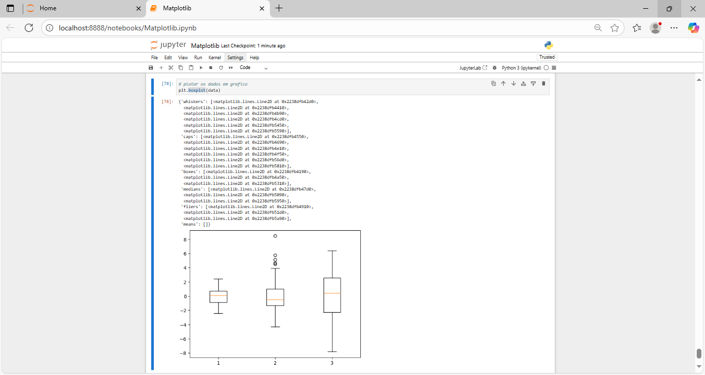
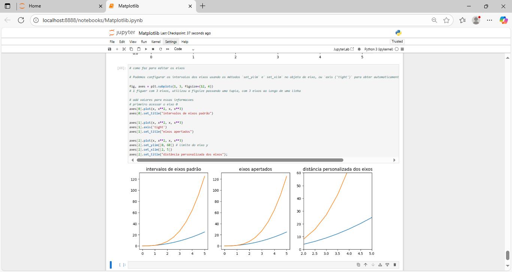

# 📊 Data Visualization with Matplotlib, 

#### Course at Asimov Academy. I learned programming from beginning to expert level.

## 🎯 What you will learn
- **Introduction to Matplotlib** and why it is powerful for data visualization  
- **Create and use subplots** to compare different data  
- **Advanced customization**: change colors, styles, and add legends  
- **Make 3D charts** for complex visual data  
- **Make heatmaps** for 2D visualizations  

---

## 📚 About the course
**Welcome to the _Data Visualization with Matplotlib_ course from Asimov Academy!**  

This course teaches you how to make **custom charts** with Matplotlib — a popular Python library for data visualization.  
You will learn how to turn raw data into **clear and useful visuals**.  
You can use these skills in **personal, school, or work projects**.  

The course steps:
1. **Basic plotting** — create simple and quick charts for first data analysis  
2. **Subplots and object-oriented use** — compare different data in one figure  
3. **Customize** — change axis, titles, labels, legends, and chart styles  
4. **Advanced charts** — make 3D charts and heatmaps  

After the course, you will know how to make **many types of data visualizations** with Matplotlib.

---

## 👥 Who is this for
- Beginners in data visualization  
- Data analysts  
- Students in engineering or data science  
- Data science professionals  
- Any professional who wants to improve visual analysis skills  

---

## 📅 Course content
| Module | Description | Status |
|--------|-------------|--------|
| 1 | Basic concepts of Matplotlib | ✅ Done |
| 2 | Creating charts with Matplotlib | ✅ Done |
| 3 | Final test | ⏳ In progress / done |

---

## 🚀 Tools and libraries
- **Python 3.x**  
- **Matplotlib**  
- **NumPy** (data handling)  
- **Pandas** (data organization and analysis)  

---

## 💡 After the course you can
- Create **clear and nice-looking visualizations**  
- Customize charts in detail  
- Make **complex charts** like 3D and heatmaps  
- Use data visualization in **any project**  

---

### img projects:

## Screenshots

Here are some images showing the layout of the application:

________________________________________

<h4 align="center">Grafic 🥰 🚀</h4>

    <table>
        <tr>
            <td style="width: 50%; text-align: center;">
                
                
figsize

            </td>
            <td style="width: 50%; text-align: center;">
                
                
comportamento_multiplas_linhas

            </td>
        </tr>
    </table>

   
   

________________________________________

    <table>
        <tr>
             <td style="width: 50%; text-align: center;">
                
                
boxplot_grafic

            </td>
            <td style="width: 50%; text-align: center;">
                
                
grafic_estograma

            </td>
        </tr>
    </table>

   
   

  ________________________________________

  
<h4 align="center">Grafic 🥰 🚀</h4>

    <table>
        <tr>
            <td style="width: 50%; text-align: center;">
                
                
varios_graf_varios_valores

            </td>
            <td style="width: 50%; text-align: center;">
                
                
graf_pontos

            </td>
        </tr>
    </table>

   
   

________________________________________

    <table>
        <tr>
             <td style="width: 50%; text-align: center;">
                
                
Alter_name_index_name

            </td>
            <td style="width: 50%; text-align: center;">
                
                
eixos_2_graf_orient_obj

            </td>
        </tr>
    </table>

   
   

  ________________________________________

<h4 align="center">Grafics 🥰 🚀</h4>

    <table>
        <tr>
            <td style="width: 50%; text-align: center;">
                
                
interacao_entre_valores

            </td>
            <td style="width: 50%; text-align: center;">
                
                
other_plotagem

            </td>
        </tr>
    </table>

   
   

________________________________________

    <table>
        <tr>
             <td style="width: 50%; text-align: center;">
                
                
img_eixo_x_y

            </td>
            <td style="width: 50%; text-align: center;">
                
                
subplot

            </td>
        </tr>
    </table>

   
   

---------

#### 🤝 Contributing
If you would like to contribute to this project, feel free to open an issue or submit a pull request! 🚀
________________________________________
#### 📜 License
This project is licensed under the MIT License - see the LICENSE file for details.
👩💻 Developed with 💙 by [[LuDiemert](https://www.linkedin.com/in/lucianadiemert/)]

________________________________________
- #### My LinkedIn - 

________________________________________
## 🌐 **Contact**

#### [**Luciana Diemert**](https://github.com/ludiemert)

🛠 Full-Stack Developer  
🖥️ Python | Computer Vision | AI Integrations  
📍 T23 R2RV,  Cork - Irland 
☎ +353 87 243 8690

&nbsp;
&nbsp;
&nbsp;
&nbsp;

 

---
Developed with ❤ by [ludiemert](https://github.com/ludiemert).
